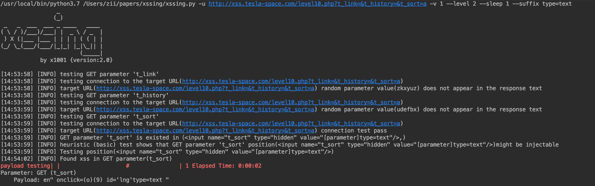

# XSSING
xssing是一个根据参数存在位置构造payload，并结合chromium保证xss的正确率。
## 安装
### 环境要求
python 3.7及以上
### 安装步骤
运行 `pip3 install -r reqirements.txt`
### Usage
XSSING选项信息
```shell
python3 xssing.py -h
```
```shell
usage: xssing.py [-h] [--version] [-v VERBOSE] [-u URL] [-r REQUESTFILE]
                 [--method METHOD] [--user-agent AGENT] [--data DATA]
                 [--cookie COOKIE] [-p PARAMETER] [--prefix PREFIX]
                 [--suffix SUFFIX] [--test-all] [--level LEVEL]
                 [--sleep SLEEP]

optional arguments:
  -h, --help          show this help message and exit
  --version           Show program's version number and exit
  -v VERBOSE          Verbosity level: 0-1 (default 0)

Target:
  At least one of these options has to be provided to define the target(s)

  -u URL, --url URL   Target URL (e.g. "http://www.site.com/vuln.php?id=1")
  -r REQUESTFILE      Load HTTP request from a file

Request:
  These options can be used to specify how to connect to the target URL

  --method METHOD     Force usage of given HTTP method (e.g. PUT)
  --user-agent AGENT  HTTP User-Agent header value
  --data DATA         Data string to be sent through POST (e.g. "id=1")
  --cookie COOKIE     HTTP Cookie header value (e.g. "PHPSESSID=a8d127e..")

Injection:
  These options can be used to specify which parameters to test for, provide
  custom injection payloads and optional tampering scripts

  -p PARAMETER        Testable parameter(s)
  --prefix PREFIX     Injection payload prefix string
  --suffix SUFFIX     Injection payload suffix string

Detection:
  These options can be used to customize the detection phase

  --test-all          test all payload
  --level LEVEL       Level of tests to perform (1-2, default 1)

Optimization:
  These options can be used to optimize the performance of xssing

  --sleep SLEEP       Seconds to wait before check (default 0)

```
## EXAMPLE
